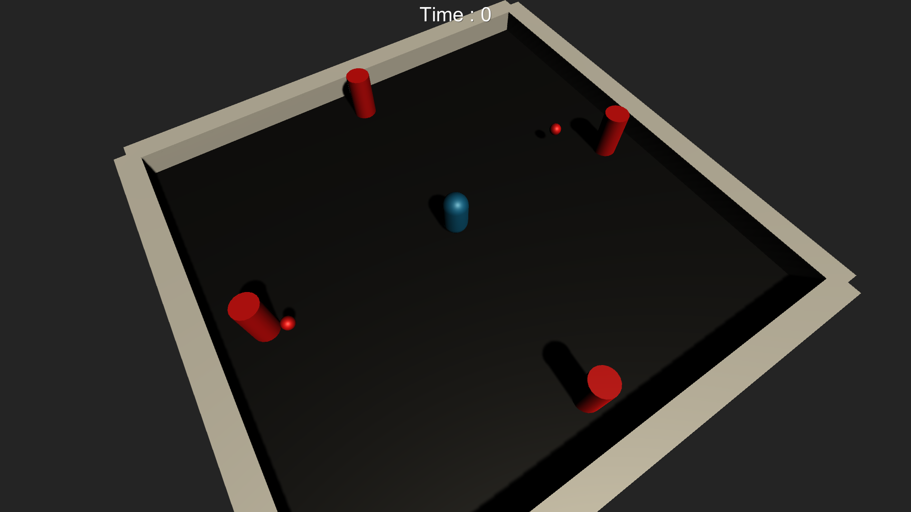
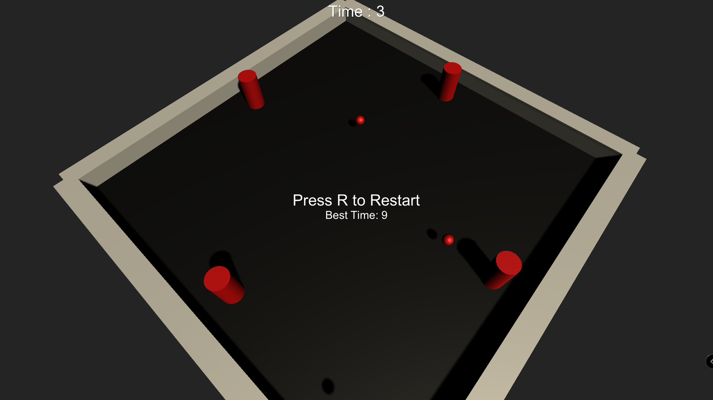
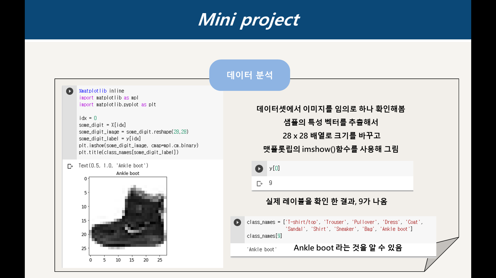
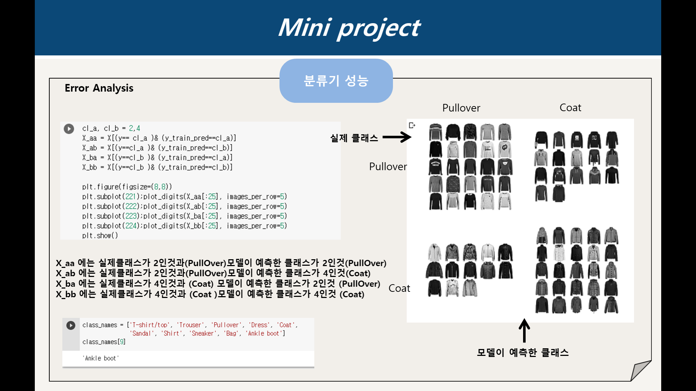
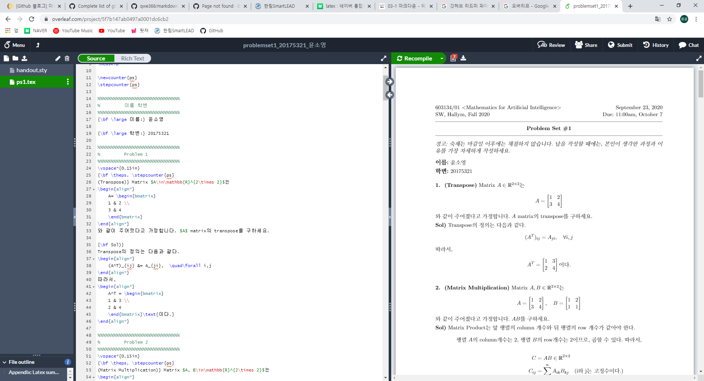

# Hi there :blue_heart:

## welcome :exclamation: I'm so young.... :wink:

---
- __Name__ : Hallym
- __Age__ : 23 (Korean age)
- __Email__ : hallym@univ.ac.kr
- __Hobby__ : 음악듣기:headphones:

    - **My Play List** :star:


    | Singer | Song |
    | -------------| --------|
    | _죠지_ | _boat_ |
    | _lany_ | _Malibu Nights_|
    | _안다, 프라이머리(Primary)_ | _The open boat (feat.colde)_|

- __Major__ : 빅데이터전공 
  - _`What to learn..`_:thought_balloon:

    - If you get more information, 'click this  <u>[_link_](https://www.hallym.ac.kr/hallym_univ/sub01/cP14/sCP11.html)</u>'

- __Available Languages__
   - JAVA

     ```java
     System.out.println("Hello Java");
     ```
   - C

     ```c
     printf("Hello C");
     ```

  - C++

     ```c++
     cout << "Hello C++!" << endl; 
     ```

  - Python

     ```python
     print("Hello Python")
     ``` 
  - C#

     ```cs
     Debug.WriteLine("Hello C#");
     ```

- __I interested in..__
   - `Linux` , `Unity`,  `Machine Learning .. Deep Learning` :computer:

        -  Linux   
            ```
            리눅스는 리누스 토르발스가 처음 출시한 운영 체제 커널인 리눅스 커널에 기반을 둔 오픈 소스 유닉스 계열 운영 체제 계열이다. 
            (출처 : https://ko.wikipedia.org/wiki/%EB%A6%AC%EB%88%85%EC%8A%A4)

            ```
        - Unity    
            ```
            유니티는 3D 및 2D 비디오 게임의 개발 환경을 제공하는 게임 엔진이자, 3D 애니메이션과 건축 시각화, 가상현실 등 인터랙티브 콘텐츠 제작을 위한 통합 저작 도구이다. 
            (출처 : https://ko.wikipedia.org/wiki/%EC%9C%A0%EB%8B%88%ED%8B%B0_%EA%B2%8C%EC%9E%84_%EC%97%94%EC%A7%84)

            ```

        -  Tensor Flow   
            ```
            텐서플로는 다양한 작업에대해 데이터 흐름 프로그래밍을 위한 오픈소스 소프트웨어 라이브러리이다. 심볼릭 수학 라이브러리이자, 인공 신경망같은 기계 학습 응용프로그램에도 사용된다. 
            (출처 : https://ko.wikipedia.org/wiki/%ED%85%90%EC%84%9C%ED%94%8C%EB%A1%9C)

            ```


---

## My Projects.. :books:

- ### __'Dodge'__ (VR/AR/게임제작기초)

   - 프로젝트 설명

     ```
     사방에서 날아오는 탄알을 가능한 한 오랫동안 피하는 탄막 슈팅 게임
     ```
  - 프로젝트 과정
     1. 씬 구성하기
     3. 플레이어 제작
    
     5. 입력매니저
      ```cs
        void Update(){

            float XInput = Input.GetAxis("Horizontal");
            float zInput = Input.GetAxis("Vertical");

            float xSpeed = XInput * speed;
            ....
        }
    ```
     6. 탄알 제작

     5. 탄알 생성기 제작
     6. 게임 매니저 제작

  - 프로젝트 중요 내용
    ```
    - Trigger Colliider 
       : 충돌한 물체를 밀어내는 물리적인 표면이 없음, 충돌자체는 감지
    - Prefab
       : 여러 컴포넌트로 이미 구성이 완성 된, 재사용 가능한 게임 오브젝트
    - Instantiate
       : 게임 도중에 실시간으로 오브젝트를 생성할 때 사용
    - ...
  - 프로젝트 결과  

    
    

---

- ### __'Fashion Mnist'__ (머신러닝)
  - 프로젝트 목적
     ```
     Fashion Mnist 데이터를 사용해서  SGDClassifier, SVC, RandomForestClassifier 의
    분류기들의 성능을 계산 후, 가장 성능이 좋은 분류기 분석
    ```

  - 데이터 분석 
   

    
  - 모델

    > [Stochastic Gradient Descent(SGD)](https://go-hard.tistory.com/11
)
   _확률적 경사하강법_

    > [support vector machine (SVM)](https://m.blog.naver.com/PostView.nhn?blogId=slykid&logNo=221630584607&proxyReferer=https:%2F%2Fwww.google.com%2F
)
        _서포트 벡터 머신_

    > [RandomForestClassifier](https://eunsukimme.github.io/ml/2019/11/26/Random-Forest/) _랜덤포레스트_
    
 
  - 성능 평가 정확도 비교
  

    | MODEL | SCORES | MEAN    |
    | -------------| --------|--------|
    | _SGD_ | _0.7844_ / 0.7897 / 0.7987  | __0.7910__
    | _SVC_ | _0.7844_ / 0.8168/ 0.8198 |__0.8070__
    | _RANDOM FOREST_ |0.8113/ 0.8108/0.8108|__0.8109__


    `" RANDOM FOREST CLASSIFIER 가 가장 평균이 높게 나옴"` 


  - ERROR ANALYSIS (RANDOM FOREST CLASSIFIER 로 한 결과)

     

     ---


- ### __'Latex'__ (인공지능 수학)
    - 프로젝트 목적
        ```
        수학 기호, 수학 공식 등 쉽게 수식을 작성할 수 있기 위함
        ```
    - Over Leaf :leaves:

        > [Over Leaf](ko.overleaf.com)  _latex편집기_

    - 코드
    

        ```
        ex) 
        \begin{align*}
        \text{행렬 $A$의 column개수는 2, 행렬 $B$의 row개수는 2이므로, 곱할 수 있다. 따라서,}
        \end{align*}

        \begin{align*}
        C &= AB\in\mathbb{R}^{2\times 2} \\
        C_{ij} &= \sum_{k=1}^n A_{ik}B_{kj} \quad\text{(i와 j는 고정수이다.)}\\
        \text{정의에 의해서, $C$ 즉}\quad AB &= \begin{bmatrix} 3 & 4 \\ 7 & 10\end{bmatrix}
        \end{align*}
        ```

---
## Plans.. :calendar:

__Linux__
- 운영체제 및 네트워크 수강 :pencil2:
- AWS EC2 를 이용한 서버 구축

 __Machine Learning__
- [Standford cs231n](https://youtu.be/3QjGtOlIiVI) 수강 :closed_book:

 __Unity__
 - 3인칭 FPS 슈팅 게임 제작


__Next Semester__
- 캡스톤 디자인 
- 장기 현장 실습 
