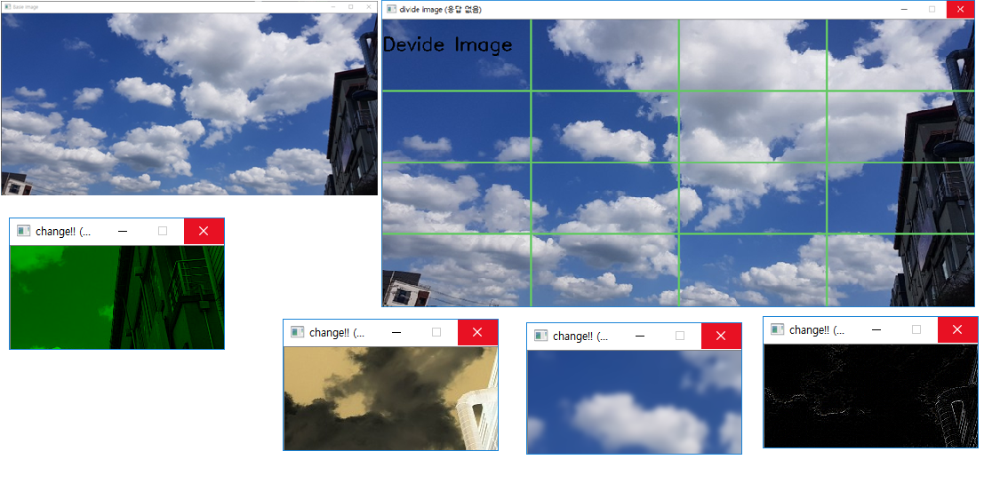

# 이력서


한림대학교 빅데이터전공 홍길동
> - __E-mail__
>> email@hallym.ac.kr
> - __전화번호__
>> __010-1234-1234__
> 
> - __학력__
>> __강원고등학교 졸업__
>>
>> __한림대학교 재학__ (2022년 졸업 예정)
> - github 주소
>> my.github.com
>
---
### 간단한 자기소개
저는 한림대학교에 재학중인 홍길동입니다.

|자기|소개|
|-----|-----|
|나이| 24살|
|취미| 음악감상|
|병역| 육군 병장 만기 전역|
|종교| 무교|
|면허|1종 보통 면허|

지금까지 사용해본 프로그래밍 언어로는
- java
- `C` (가장 선호하는 프로그래밍 언어)
- C++
- C#
- python
- R

등이 있습니다.

최근에는 linux 운영체제에서 C언어를 프로그래밍을 공부중이고, linux 환경에서 프로그래밍을 하는 다른 사람들에게 알려 줄 수 있는 수준으로 끌어 올리는 것이 이상적인 목표입니다.

 목표에 가까운 수준의 프로그래밍을 하게 된다면 숫자야구, 스도쿠같은 게임 구현이나 통신에 활용될 수 있는 프로그램을 만들고 싶습니다.

---
## 프로젝트 경험
이렇다 할 수상 경력이 없어서 지금까지 컴퓨터공학에 대해 공부하면서 진행했던 프로젝트에 대한 리뷰입니다.

### 1_1 python turtle image
---


- [1_1_python](https://github.com/jaeseonglee/1_1_python)

2016년 1학년, python을 배우며 turtle 모듈을 통해 여러 그림을 그렸던 프로젝트입니다.

링크를 통해 코드를 보면 1학년때라 그런지 주석도 없고 수정 사항이 몇몇 보이긴 하지만 당시엔 코드를 통해 무언가 결과를 도출해내는 성취감에 만족하면서 진행했었습니다.

실제로 사용한 함수는 적은 편이고 코드도 짧은 편이라고 생각합니다.

아래는 당시 사용했던 코드를 일부 정리했습니다.
```python
import turtle           # turtle 모듈
tur = turtle.Turtle()   # 변수에 turtle 객체 저장

tur.shape('turtle')     # 거북이 모양 뿐만 아니라 
                        # 'classic' : 화살표, 'triangle' : 삼각형 등이 있습니다.

tur.color('blue')       # 색깔 변경 

tur.penup()             # penup 하면 그리지 않는 형태
tur.pendown()           # pendown 하면 그리는 형태

tur.forward(100)        # 현재 방향대로 100 만큼 전진

tur.right(180)          # 오른쪽으로 180도 회전
tur.hideturtle()        # 그리기 포인터 숨기기
```


---
### 1_2 java calculator
---

- [calculator](https://github.com/jaeseonglee/1-1-Eclipse-File/blob/master/H.U.S/Calculator.java)

1학년 때는 동아리 활동을 통해서 선배들, 동기들과 함께 프로그래밍을 공부했었습니다.

java를 배우던 교재와 오픈소스를 활용해 프로그래밍을 하고, 동아리에서 질문과 수정을 통해 완성한 프로그램이라 기억에 많이 남습니다.

링크를 확인하면 역시나 이 때도 주석을 쓰는 습관이 부족한 것을 확인 할 수 있습니다.
```java
private void calculate (double n) {
		if(operator.equals("+"))
			result += n; // 덧셈   
		else if (operator.equals("-"))
			result -= n; // 뺄셈
		else if (operator.equals("x"))
			result *=n;  // 곱셈
		else if (operator.equals("/"))
			result /= n;  // 나눗셈
		else if (operator.equals("="))
			result = n;  // 결과
		else if (operator.equals("%"))
			result %= n;  // x를 y로 나눈 나머지
		else if (operator.equals("sqrt")) 
			result = Math.sqrt(n);
		else if (operator.equals("+/-")) {
			result =  (double) n * -1.0;
		}
		display.setText(" " + result);
	}
```

### 2_1 Digital image processing(+opencv, C++)
---
군대 전역 후, 과거 코드들을 보면서 스스로의 단점을 보완하고자 마음먹었던 2학년입니다. 하지만 마음먹은 대로 일이 이뤄지지 않더라구요 :laughing:



- [Digital_image_processing_final_project](https://github.com/jaeseonglee/2-1-Digital-Image-Processing/blob/master/Final_Project/main.cpp)

위 링크의 코드는 opencv를 응용하기 때문에 opencv를 먼저 설치한 후 실행이 가능합니다.

프로그램을 요약하면 주어진 사진을 먼저 보여주고 그 사진을 분할합니다.

다시 분할 화면에 대해서 영상처리기법을 적용해 보여주고 원래 어떤 위치에 있었는지 맞추는 프로그램입니다.

- 복학한 후 C언어를 배우는 단계인데, C++ 언어가 선수과목으로 요구되는 영상처리 프로그래밍의 기말 프로젝트입니다. ~~수강신청 실패사례~~

- 그래서 코드를 보시면 cpp 파일인데도 cin,cout대신 printf(),scanf()함수가 쓰이는 것을 확인할 수 있는데, 덕분에 C++이 C를 지원해주는 것을 알 수 있었고 정말 고맙다고 느꼈습니다.

```c++
void devideImage(Mat img, int num) {		// 영상이 저장된 img와 사용자가 입력한 정수 num을 매개변수로 갖는다.
	int i, j;								// 반복문에서 사용할 변수
	for (i = 1; i < num; i++) {			// 영상을 분할할 직선을 그리기 위해 얼만큼 분할할지에 대한 반복문
		for (j = 1; j < num; j++) {
			line(img, cvPoint(img.cols / num * i, 0), cvPoint(img.cols / num * i, img.rows), CvScalar(100, 200, 100), 2);
			line(img, cvPoint(0, img.rows / num * j), cvPoint(img.cols, img.rows / num * j), CvScalar(100, 200, 100), 2);
		
			/*	line(이미지,X,Y,색상,직선의 크기)
				line함수를 통해 X에서 부터 Y까지 어떤 색상으로 어떤크기만큼 직선을 그린다.
				cvPoint함수를 통해 위치를 지정해주고, 영상의 가로축과 세로축을 기준으로 직선을 그린다.
				
				CvScalar(Bule,Grenn,Red) BGR의 순서인것에 유의한다.*/
		}
	}
}
```

당시 C에 대해서도 제대로 숙지하지도 못한 채로 프로그래밍을 해서, 아마도 다시 이 코드를 수정한다면 전부 갈아엎고 C++에 맞춰 작성해야 할겁니다.

그 대신에 난장판인 코드라도 주석을 통해 확인할 수 있도록, 주석을 쓰는 습관을 들이게 되는 결정적인 프로젝트였습니다. 

### 3_1 window programming(C#)
---
- 3학년이 되면서 linux 운영체제를 배우고, 또 다른 언어들과 이론들을 배웠습니다. 그 중에 C#을 활용한 윈도우 프로그래밍입니다.


- [Ghost_Leg_Game](https://github.com/jaeseonglee/3-1-Csharp/tree/master/CS_final_project/20165153/Ghost_Leg_Game/Game_Action.cs)

위는 윈도우 프로그래밍 강의에서 했던 사다리 타기 게임 구현입니다.

나름 정성들이고 열심히 했지만 tab키와 같은 상정외의 입력에서는 오류가 있는 것이 아쉬운 프로젝트였습니다.

그래도 당연한 얘기겠지만 저학년 때에 비해서는 많이 실력이 늘었다고 생각합니다.

### 3_2 지금 그리고 앞으로
---
스스로의 역량을 키우기 위해서 이해하는 것이 중요하다고 생각하기 때문에, 지금까지 그래왔듯이 앞으로도 배우는 것에 최선을 다하고 응용할 수 있도록 할 것입니다.

아직 이력서라고 하기에는 너무나도 부족하지만, 정말 인정받을 만한 수준의 수상 경력과 오픈소스 기여, 프로젝트 이력 등이 이력서를 채워낼 수 있도록 열심히 하겠습니다.

---

여기까지 저의 이력서를 읽어주셔서 감사합니다. :smile:
